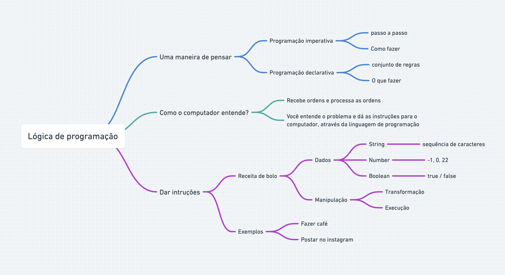
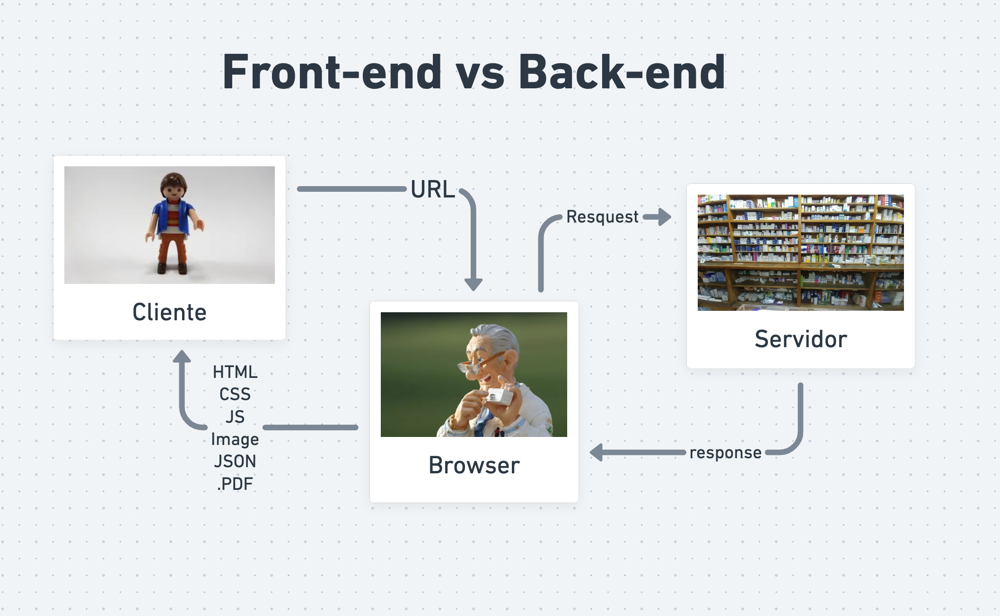

# Stage 01 - Fundamentos da programação WEB

- O que é Programação? - 10:41
    * Programação é o ato de programar, capturar e tratar dados em um fluxo de eventos numa ordem lógica gerando tarefas para obter um resultado.

    * Como programar?
    * A programação depende de alguns fatores para ter um resultado em si, são eles:

    - Algoritmos: Um passo a passo para resolver um problema.
    - Lógica de programação: Pensar de uma maneira lógica
    - Linguagem: Tem que ter um significado é semelhante a nossa linguagem humana, mas transformada para linguagem de máquina (0 e 1).
    - Porque programar?
    - Para encontrar soluções e resolver problemas do mundo real.

    * O que é um programa?
    * Conjunto de instruções lógicas.
    

---
- Lógica de Programação - 12:08
    * Lógica de programação é uma maneira de pensar seguindo uma sequência lógica de instruções, seja para construir um programa ou até fazer uma tarefa simples.

    * Maneiras de pensar:
        * Programação imperativa: Dar ordens - Seguir passos e sequências se preocupa com os detalhes.
        * Programação declarativa: Declaração - Conjunto de regras definidos nem tanto aprofundado.

    * Como o computador entende?
        * O computador não tem capacidade intelectual, ele recebe ordens (instruções) através de linhas de comando (linguagem de programação).

    * Dar Instruções: Seguindo uma sequência lógica contendo dados e manipulando o programa, sistema, site.
    
---
- O que é e como funciona a Web? 15:30
    * Web: Teia - Rede mundial de computadores.
    * Como funciona a Web
    * Quando você digita um endereço no seu navegador ex: https://rocketseat.com.br, esse endereço navega até o servidor de DNS (Domain Name System) e esse endereço digitado é convertido para um IP (Internet Protocol). O client (browser) manda uma requisição HTTP (Hypertext Transfer Protocol) para o servidor pedindo uma cópia do site. Todos esses são fornecidos através do protocolo TCP (Transmission Control Protocol). Com todo esse trajeto, você tem uma cópia do site completo em seu navegador.
    
---
- Front-end VS Back-end - 09:04 
    * Nessa aula vimos a diferença entre Front-end e Back-end. 
    * Front-end: É a parte visual do nosso site, onde conseguimos ter uma certa interação. Programadores front-end utilizam as tecnologias (HTML, CSS, JavaScript) algumas bibliotecas e frameworks como ReactJS, Angular, Vue e ferramentas (Webpack e Babel) 
    * Back-end: Programadores back-end já trabalham mais do lado do servidor, onde está a regra de negócio. Normalmente é utilizada tecnologias como: NodeJS, PHP, Java, Python e banco de dados (mySQL, PostgreSQL, MongoDB).
  
  
  
---